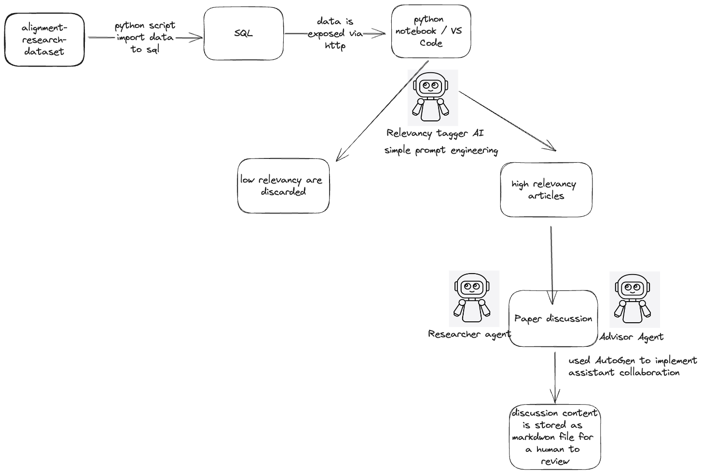

# AI Alignment Toolkit Research Assistant

We want to create a set of tools specifically dedicated to augment AI Alignment researchers with their job.
In this project we tacke two problems:

* "Proactive insight extraction from new research"
* "Using AI agents to automate alignment research"

We have attempted to build an end to end pipeline where AI Agents are able to complete whole tasks:
* We created an API to fetch latest articles relevant to AI Alignment. The data source is from https://huggingface.co/datasets/StampyAI/alignment-research-dataset/tree/main
* We let he AI Reserach Assistant go through the content of each new article and give a relevency score on how relevant it is to the current project
* We then let 2 AI agents a Reseracher role and Advisor role to discuss the article to understand how it can contribute and help with AI Alignment
* The system keeps track of which articles have been tracked, so that you can keep running this pipeline which will try to get new articles.

Benefits of the system:
* Can continously fetch new articles so that the reseracher is up to date with latest happenings
* Low relevancy articles are discarded so that we don't waster researchers' time on those
* Article discussions have potential to serve many purposed:
  * Be a summary of the relevant content so the researcher can get up to speed fast
  * Improve your current project by taking ideas from the article
  * Generate novel ideas on what we can do with the findings of the articles

## Technical overview

</img>

